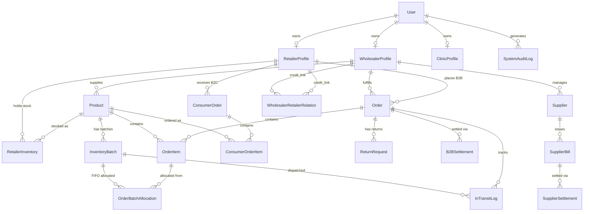

# 🏥 MedHub — Nepal's Verified Pharmaceutical Ledger & B2C Marketplace Network

[](https://nextjs.org/)
[](https://www.typescriptlang.org/)
[](https://www.postgresql.org/)
[](https://www.prisma.io/)
[]()

MedHub is Nepal's premier verified pharmaceutical ecosystem designed to solve inventory loss, expired drug distribution, unregulated prescription drug sales, and multi-tier supply chain opacity. 

It connects **Wholesale Distributors**, **Licensed Retail Pharmacies**, **Patients/Consumers**, and a **Superadmin Matrix Center** on a single double-entry ledger with real-time WebSocket event synchronization.

---

## 🌟 Key Platform Features

### 🏢 1. Wholesale Distributor Terminal
- **Batch Ingestion & Strip Sizing**: Register incoming drug batches with manufacturing cost, selling box price, tablets per strip, and strips per box.
- **Code128 Barcode Engine**: Auto-generate scannable Code128 barcodes for every batch entry.
- **Automated FIFO Allocation**: Orders automatically lock the earliest-expiring batch to prevent stock expiration.
- **Advance Credit & Payment Ledger**: Set per-pharmacy credit limits, track advance payments, and record settlement notes.
- **Multi-Staff RBAC Isolation**: Create staff accounts with granular feature permissions (`Dashboard`, `Medicines`, `Orders`, `Billing`, `POS`, `Logs`).
- **Supplier Bill & Settlement Tracking**: Record supplier purchase bills, payment breakdowns, and partial settlements.
- **Walk-in Counter POS**: Dedicated sales terminal with barcode scanner support, instant stock deduction, and thermal receipt printing.

### 💊 2. Retail Pharmacy Terminal
- **Wholesale B2B Purchasing Portal**: Browse distributor catalogues, inspect tier pricing, place orders, and track dispatch status.
- **Retail Inventory & Rack Placement**: Track retail stock per batch with custom rack/shelf location tagging (e.g., `Rack A-4`).
- **Walk-in Counter Billing**: Rapid point-of-sale terminal supporting thermal receipt generation and IRD-compliant VAT billing.
- **Class-A Prescription Verification**: Review patient prescription image uploads and verify doctor NMC numbers before dispensing regulated drugs.
- **Customer Database**: Maintain order history, patient contact profiles, and delivery fee rules per km radius.

### 🩺 3. Patient / Consumer Marketplace
- **Haversine Geolocation Radius Search**: Locate open pharmacies stocking required medicines within 1km, 3km, 5km, or 10km radius using exact PostGIS coordinates.
- **Class-A Medicine Ordering**: Secure upload interface for prescription photos and prescribing doctor's NMC registration number.
- **Real-Time Order Tracking**: Live status transitions (`PENDING` → `APPROVED` → `SHIPPED` → `DELIVERED`) powered by persistent WebSockets.

### 🛡️ 4. Superadmin Compliance Matrix
- **PAN / DDA License Verification**: Audit submitted business tax IDs, Drug Administration (DDA) licenses, and registration documents before account activation.
- **Subscription Package Gating**: Configure subscription packages (`Bronze`, `Silver`, `Gold`) and automatically enforce expiration lockouts.
- **System Audit Log Matrix**: Track every critical transaction, credit override, stock alteration, and user access event across all tenants.

---

## 📐 Database Schema & Entity Relationship (ER) Diagram

MedHub uses PostgreSQL with **Prisma ORM**. The data model enforces strong integrity across multi-tenant profiles, stock batches, orders, and settlements.



### Key Database Models Summary

| Model | Purpose | Key Attributes |
|---|---|---|
| `User` | Core authentication & staff table | `email`, `role`, `passwordHash`, `isVerified`, `packageName`, `subscriptionEnd` |
| `WholesalerProfile` | Distributor business profile | `companyName`, `taxId` (PAN/VAT), `phone`, `latitude`, `longitude` |
| `RetailerProfile` | Pharmacy store profile | `pharmacyName`, `registrationNumber` (DDA), `creditLimit`, `lifetimeSpend` |
| `Product` | Master drug catalogue | `name`, `sku`, `tabletsPerStrip`, `stripsPerBox`, `medicineClass` (`CLASS_A` / `CLASS_NORMAL`) |
| `InventoryBatch` | FIFO batch inventory | `batchNumber`, `expiryDate`, `totalBaseUnits`, `availableBaseUnits`, `barcodeUrl` |
| `Order` | B2B Wholesale Order | `status`, `totalAmount`, `discountAmount`, `netAmount`, `advanceApplied`, `settleStatus` |
| `OrderBatchAllocation` | Atomic FIFO batch lock | `orderItemId`, `batchId`, `quantity` (base units) |
| `LedgerEntry` | Double-entry financial record | `partyType`, `partyId`, `type` (`SALE`/`PAYMENT`/`RETURN`), `debit`, `credit`, `balance` |
| `ConsumerOrder` | Patient B2C order | `trackingCode`, `buyerName`, `prescriptionImagesJson`, `doctorNmcNumber`, `status` |

---

## 🔌 API Endpoints Reference

### 🔐 Authentication & Session
- `POST /api/auth/register` — Business partner & staff registration with document upload
- `POST /api/auth/login` — Authentication with JWT session cookie issuance & subscription check
- `GET /api/auth/me` — Current authenticated user context & profile data
- `GET /api/auth/logout` — Revoke session JWT cookie

### 📦 Wholesaler Endpoints
- `GET/POST /api/wholesaler/inventory` — Manage master products, batches & barcode generation
- `GET/POST /api/wholesaler/orders` — Review B2B orders, trigger FIFO dispatch & generate invoices
- `GET/POST /api/wholesaler/suppliers` — Supplier catalogue & purchase bill settlements
- `GET/POST /api/wholesaler/pos` — Counter POS sales terminal & instant stock deduction
- `GET/POST /api/wholesaler/billing` — Double-entry ledger audit & advance payment recording
- `GET/POST /api/wholesaler/staff` — Create staff accounts with feature permission masking

### 🏥 Retailer Endpoints
- `GET/POST /api/retailer/inventory` — Retail stock management & rack placement tagging
- `GET/POST /api/retailer/orders` — Place wholesale B2B orders with credit limit enforcement
- `GET/POST /api/retailer/pos` — Counter POS terminal & thermal VAT receipt printing
- `GET/POST /api/retailer/customers` — Customer order tracking & B2C prescription reviews

### 🛒 B2C Consumer Endpoints
- `GET /api/orders/consumer` — Search nearby pharmacies by Haversine coordinates & stock availability
- `POST /api/orders/consumer` — Place online medicine order with prescription photo & doctor NMC number
- `GET /api/orders/consumer/track` — Real-time order status lookup by tracking code

### 🛡️ Superadmin Endpoints
- `GET/POST /api/superadmin/partners` — Approve/Reject partner PAN/DDA/NMC registration applications
- `GET/POST /api/superadmin/subscriptions` — Package tier management (`Bronze`/`Silver`/`Gold`)
- `GET /api/events` — WebSocket SSE endpoint for real-time live dashboard sync

---

## 🛠️ Technology Stack

- **Framework**: [Next.js 16.2.7 (App Router)](https://nextjs.org/)
- **Language**: [TypeScript 5.0](https://www.typescriptlang.org/)
- **Database & ORM**: PostgreSQL with PostGIS extension + [Prisma ORM 6.x](https://www.prisma.io/)
- **Styling**: Modern Vanilla CSS Design System with custom dark/light themes (`landing.css`, `globals.css`)
- **Icons**: [Lucide React](https://lucide.dev/)
- **Authentication**: JWT (`jose` / `jsonwebtoken`) + `bcryptjs` password hashing
- **Real-Time Engine**: WebSockets / Server-Sent Events (`/api/events`)

---

## ⚡ Quick Start & Setup Guide

### 1. Prerequisites
- Node.js >= 18.x
- PostgreSQL database with PostGIS extension enabled

### 2. Clone & Install
```bash
git clone https://github.com/sujalmehta004/majorProject.git
cd majorProject
npm install
```

### 3. Environment Configuration
Create a `.env` file in the root directory:
```env
# Database Connection (PostgreSQL)
DATABASE_URL="postgresql://sujalmehta@localhost:5432/medhub?schema=public"

# JSON Web Token Secret
JWT_SECRET="medhub_super_secret_key_12345_sprint1"

# Nodemailer Configuration (OTP Verification & Emails)
EMAIL_USER="your-email@gmail.com"
EMAIL_PASS="your-app-password"

# Timezone — Nepal Standard Time (UTC+5:45)
TZ=Asia/Kathmandu
```

### 4. Database Setup & Migration
```bash
npx prisma migrate dev --name init
npx prisma db seed
```

### 5. Run Development Server
```bash
npm run dev
```
Open [http://localhost:3000](http://localhost:3000) in your browser.

---

## 📜 Compliance & Verification Summary

| Verification Layer | Target Actor | Verified Elements |
|---|---|---|
| **PAN / VAT Tax Audit** | Wholesaler | Permanent Account Number, VAT Certificate, Business License |
| **DDA Registration** | Retail Pharmacy | Department of Drug Administration License, Pharmacist Registration |
| **NMC Doctor License** | Patient / Consumer | Nepal Medical Council Doctor ID + Rx Photo for Class-A Drugs |
| **Superadmin Lock** | All Tenants | Manual approval matrix before transaction features unlock |

---

## 📄 License
Proprietary — All Rights Reserved © MedHub Nepal.
